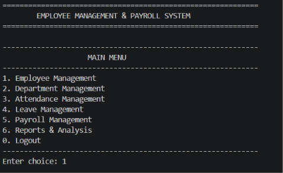
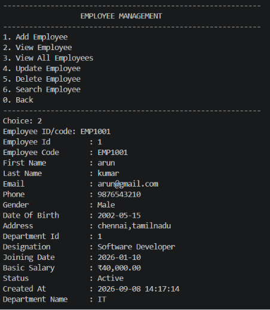
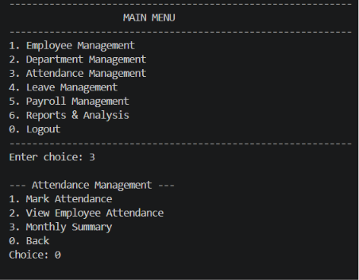
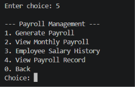

# Employee Management & Payroll System

A console-based Employee Management and Payroll System developed using Python and MySQL.

The system helps manage employees, departments, attendance, leave, payroll, and business reports through a structured menu-driven application.

## Features

### Employee Management
- Add new employees
- View employee details
- View all employees
- Update employee information
- Search employees
- Delete employees

### Department Management
- Add departments
- View departments
- Update department information
- Delete departments

### Attendance Management
- Mark employee attendance
- View employee attendance
- Generate monthly attendance summaries

### Leave Management
- Apply for leave
- View leave records
- Approve leave
- Reject leave

### Payroll Management
- Generate monthly payroll
- Calculate gross salary
- Calculate deductions
- Calculate net salary
- View monthly payroll
- View employee salary history
- View individual payroll records

### Reports & Analysis
- Employee statistics
- Department salary reports
- Monthly payroll summaries
- Export payroll data to CSV

## Technologies Used

- Python 3
- MySQL
- mysql-connector-python
- Pandas
- python-dotenv
- SQL
- Git & GitHub

## Project Structure

```text
Employee_Payroll_System/
│
├── main.py
├── requirements.txt
├── README.md
├── .env.example
├── .gitignore
│
├── database/
│   └── schema.sql
│
├── config/
│   ├── __init__.py
│   └── database.py
│
├── services/
│   ├── __init__.py
│   ├── employee_service.py
│   ├── department_service.py
│   ├── attendance_service.py
│   ├── leave_service.py
│   └── payroll_service.py
│
├── utils/
│   ├── __init__.py
│   ├── helpers.py
│   ├── validators.py
│   └── salary_calculator.py
│
└── reports/
    ├── __init__.py
    └── reports.py
    
## Screenshots

### Main Menu


### Employee Details


### Attendance Management


### Payroll Management


